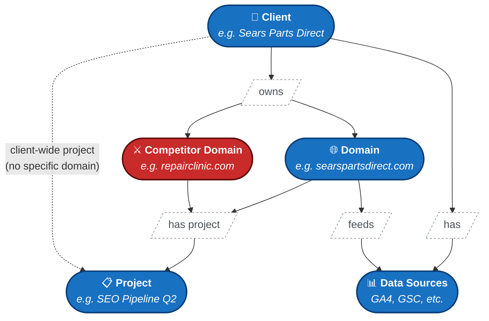
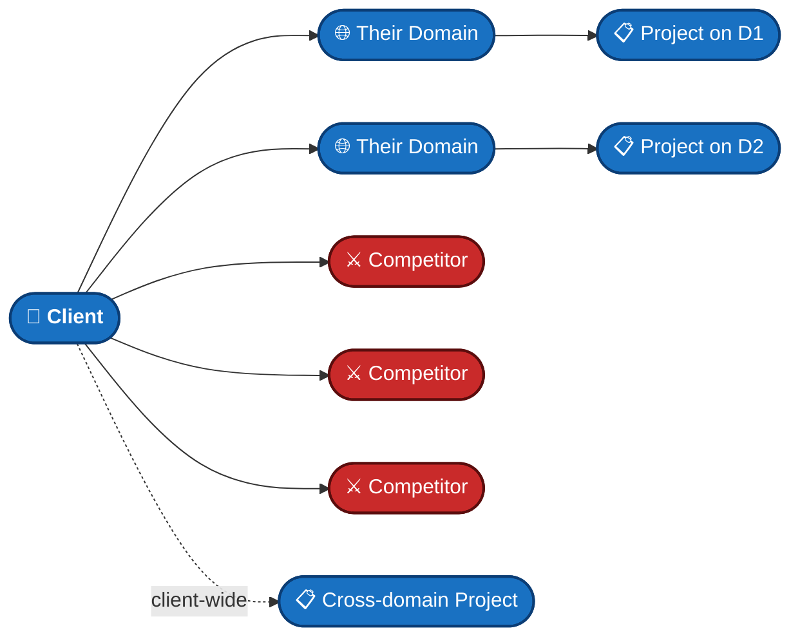
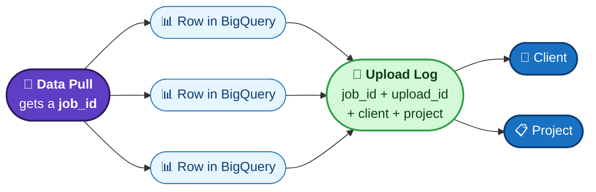
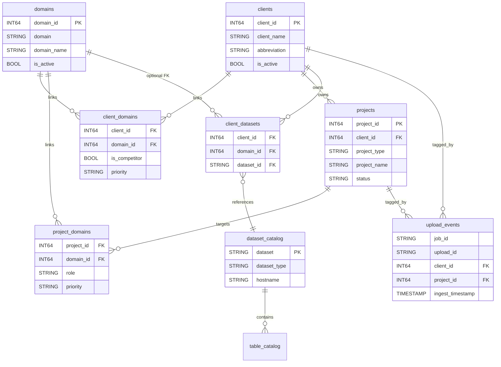

# Skyward Meta Hierarchy

How clients, domains, projects, and competitors fit together — at a glance.

Related: [[Implementation - Meta Tables]], [[2026-03-30 Meta Tables Redesign]], [[BQ Schema Audit]]

---

## The Big Picture

**How to read it:** Blue boxes are the **things** Skyward tracks. Red boxes are **competitors** (same kind of thing as a domain, just flagged differently). Small white labels in between are the **relationships** that connect them.

**The typical flow is Client → Domain → Project** — most projects target a specific domain (or competitor domain). The dotted arrow shows the shortcut: a project can also live directly under the client when it's not tied to any one domain (e.g. a cross-domain analysis or a client-wide initiative).

---

## A Client's World

What every client looks like in the system:

A client can have **many** domains of their own, **many** competitor domains they want to watch, and **many** projects running at once.

---

## Following the Data

When Skyward pulls data (say, from DataForSEO), how does that row know which client / project it belongs to?

**The trick:** every row carries a `job_id` and `upload_id`. Those IDs are the breadcrumb trail back to who the data belongs to.

---

## Statuses You'll See

| Thing | Status options | What it means |
|---|---|---|
| 🏢 Client | active / inactive | Whether we're still working with them |
| 🌐 Domain | active / inactive | Whether we're still tracking it |
| 📋 Project | active / complete / deactivated | Where the project is in its lifecycle |
| ⚔️ Competitor flag | yes / no | A domain marked as a competitor instead of a client's own |
| ⭐ Priority | low / normal / high | How important a domain is to a client or project |

---

## The Words That Connect Things

When you see something like "Sears has 3 competitors and 2 projects," here's where each piece lives:

| Phrase | What's actually happening |
|---|---|
| "Client **has** domain" | Connected via `client_domains` |
| "Client **has** competitor" | Connected via `client_domains`, with the competitor flag on |
| "Domain **has** project" | The project record points to its client, and the domain is attached via `project_domains` |
| "Client **runs** a client-wide project" | The project record points to the client, with no rows in `project_domains` |
| "Project **targets** domain" | Connected via `project_domains` (one project can target multiple domains) |
| "Client **has** data source" | Connected via `client_datasets` |
| "Domain **feeds** data source" | Same `client_datasets` row, with the domain attached so we know which property the data is for |

You don't need to know these table names to use the system — but if someone says "check `client_domains`," now you know it just means "the list of which clients have which domains."

---

## For the Technically Curious

Click to see the full database schema

### ID Conventions

Every Client, Domain, and Project has a numeric ID (`client_id`, `domain_id`, `project_id`) auto-generated when it's created. Data sources use their real BigQuery dataset name as the ID (e.g. `analytics_123456789`).

### Full Schema (ER Diagram)

### DataForSEO Row-Level Tagging

Every row in the 11 DataForSEO endpoint tables carries: `job_id`, `upload_id`, `ingest_timestamp`, `domain_id`, `domain`, `task_id`, `endpoint_mode` — so any row can be traced back to a client/project via `upload_events.job_id`.

### Notes

- BigQuery does **not** enforce foreign keys — the relationships are convention, enforced in `MetaClient` Python code.
- A single `domains` row is shared across customers: it can be a client's own domain to one customer and a competitor to another, distinguished by the flag on the link row.

